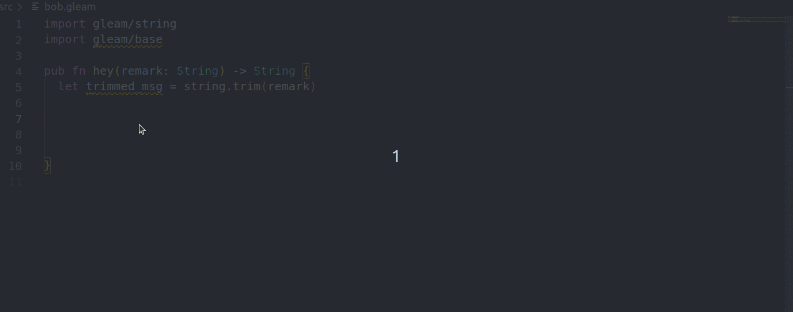

# VS Code Gleam

[](https://marketplace.visualstudio.com/items?itemName=Gleam.gleam)

Gleam support for VS Code using the Gleam Language Server.


## Hacking on the extension

Run `npm run compile-watch` in a terminal and hit F5 in vscode.

Install using `ctrl + shift + p` -> `Install Extension from Location` -> Select this folder


## Refreshing the autocomplete 

[

The autocomplete is made using a kinda ugly method, this is a temporary solution and I think
it should be replaced with something cleaner.

Behind the scene, it parses the https://hexdocs.pm/gleam_stdlib/ website and get the definition
of each function. It then concatenates in a `src/autocomplete.ts` file. 

```bash
# create and activate new virtual environment
python3 -m venv venv
source venv/bin/activate

# install dependencies for the script
pip install -r scripts/requirements.txt

python scripts/generate_autocomplete.py

```